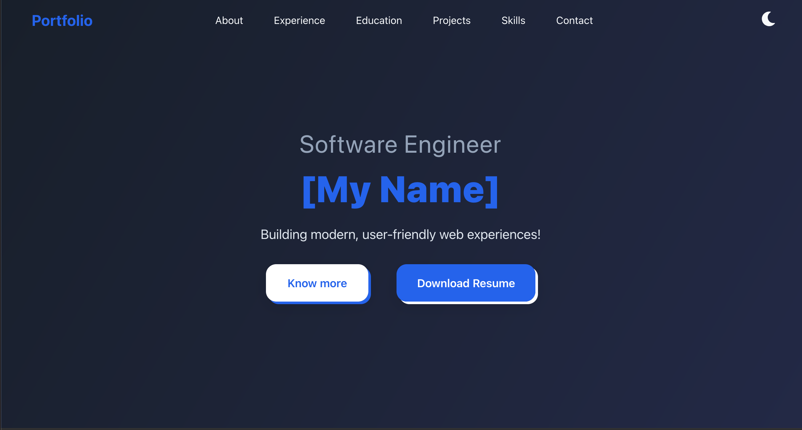

# Portfolio Template

A sleek, customizable, and responsive portfolio template built with React to showcase your skills, projects, and achievements. Deploy to GitHub Pages with a simple command, following our step-by-step guide!

[View Live Demo](https://lam200213.github.io/portfolio)

## Table of Contents

- [About the Project](#about-the-project)
- [Built With](#built-with)
- [Getting Started](#getting-started)
  - [Prerequisites](#prerequisites)
  - [Installation](#installation)
- [Deployment to GitHub Pages](#deployment-to-github-pages)
- [Customization](#customization)
- [Usage](#usage)
- [Troubleshooting](#troubleshooting)
- [License](#license)
- [Contact](#contact)
- [Acknowledgments](#acknowledgments)

## About the Project

A personal portfolio website template built with React, designed to help users create a modern and professional online presence. It features a clean design with sections for About, Experience, Projects etc, all built with React for dynamic rendering and easy customization. 

### Features
- **Responsive Design**: Works seamlessly on mobile, tablet, and desktop.
- **Customizable Sections**: Easily update content for all sections.
- **CSS Modules**: Utilize CSS Modules for styling, allowing for modular and reusable CSS code.
- **GitHub Pages Ready**: Deploy your portfolio with a single command.
- **Contact Section**: Setup your EmailJS, allowing people to connect with you in no time. 
- **Built with Vite:**: Providing rapid development and optimized production builds.

### Screenshots


## Built With

- [React](https://reactjs.org/) - JavaScript library for building user interfaces
- [Vite](https://vite.dev/) - Build tool for React projects
- [gh-pages](https://www.npmjs.com/package/gh-pages) - Deployment tool for GitHub Pages
- [CSS](https://developer.mozilla.org/en-US/docs/Web/CSS) - Styling for the portfolio

## Getting Started

Follow these steps to set up the portfolio template locally.

### Prerequisites

- [Node.js](https://nodejs.org/) (v14 or higher) and npm
- [Git](https://git-scm.com/)
- Basic knowledge of React and JavaScript
- A GitHub account for deployment

### Installation

1. **Clone the repository**:
   ```bash
   git clone https://github.com/lam200213/portfolio.git
   cd portfolio
   ```

2. **Install dependencies**:
   ```bash
   npm install
   ```

3. **Start the development server**:
   ```bash
   npm run dev
   ```
   Open `http://localhost:5173` or other port according to the instruction to view the portfolio locally.

## Deployment to GitHub Pages

To deploy your portfolio to GitHub Pages:

1. **Install the `gh-pages` package** (if not already installed):
   ```bash
   npm install gh-pages --save-dev 
   ```

2. **Edit the `homepage` field on `package.json`**:
   ```json
   "homepage": "https://{your-username}.github.io/{your-repo-name}"
   ```

3. **Create a GitHub repository** and set the remote:
   ```bash
   git remote add origin https://github.com/{your-username}/{your-repo-name}.git
   ```

4. **Push the React app to the GitHub repository**:
   ```bash
   npm run deploy
   ```
5. **Configure GitHub Pages**:
  Go to Setting->Pages and configure the "Build and deployment" settings like this:
    Source: Deploy from a branch
    Branch: gh-pages
    Folder: / (root)

  Don't forget to click "save".

  Your portfolio will be live at `https://{your-username}.github.io/{your-repo-name}/`.

## Customization

Personalize the portfolio by editing the data.js, for example:

- **Content**: Update `src/data.js` (or similar) with your details:
  ```javascript
  export const portfolioData = {
    name: "Your Name",
    bio: "A passionate developer based in [Your Location]...",
    projects: [
      {
        title: "Project 1",
        description: "A web app built with React",
        link: "https://example.com",
        image: "/images/project1.png"
      }
    ],
    contact: {
      email: "your.email@example.com",
      github: "https://github.com/your-username"
    }
  };
  ```

- **Styles**: Modify `src/styles/global.css` or component-specific CSS under `src/styles/components/` to change colors, fonts, or layouts.
- **Images**: Place images in `public/images/` and reference them with root-relative paths:
  ```jsx
  
  ```

- **SEO**: Edit `public/index.html` to update the title and meta tags:
  ```html
  <title>Your Name - Portfolio</title>
  <meta name="description" content="Portfolio of Your Name, a [your profession]">
  ```

## Usage
Edit the data.js for adding personal content.

To add a new project to the portfolio:

1. Update `src/data.js` with project details:
   ```javascript
   projects: [
     {
       title: "New Project",
       description: "A brief description",
       technologies: ['React', 'Node.js', 'MongoDB', 'Express'],
       github: 'https://github.com/yourusername/ecommerce',
       demo: 'https://ecommerce-demo.com',
       image: "./images/new-project.png"
     }
   ]
   ```

2. Add the project image to `public/images/`.
3. Run `npm run dev` to preview changes locally.
4. Deploy updates with `npm run deploy`.

## Troubleshooting

- **Images not loading on GitHub Pages**:
  - Ensure `homepage` is set in `package.json`.
  - Use relative path (`/images/example.png`) 
  - Verify images are in `dist/images/` after `npm run build` and in the `gh-pages` branch.
  - Check the browser’s Network tab (F12) for 404 errors and correct paths.

- **Unexpected `stats.html` file**:
  - If a `stats.html` file appears in `build/`, it’s from the Webpack Bundle Analyzer (`ANALYZE=true`).
  - Disable it by removing `ANALYZE=true` from `.env` or scripts.
  - Exclude from deployment:
    ```json
    "deploy": "gh-pages -d build --before-add 'rm build/stats.html'"
    ```

- **404 errors on GitHub Pages**:
  - Confirm GitHub Pages is set to the `gh-pages` branch in Settings → Pages.
  - Check the `gh-pages` branch on GitHub for correct files.

For more help, open an issue on the repository.

## License

Distributed under the MIT License. See [LICENSE](LICENSE) for details.

## Contact

- GitHub: [lam200213](https://github.com/lam200213)
- Email: [terrylam.official@gmail.com]
- Open an issue on this repository for support.

## Acknowledgments
- [Vite JS](https://vite.dev/) for the project setup.
- [gh-pages](https://www.npmjs.com/package/gh-pages) for easy deployment.
- Inspired by [gitname/react-gh-pages](https://github.com/gitname/react-gh-pages).